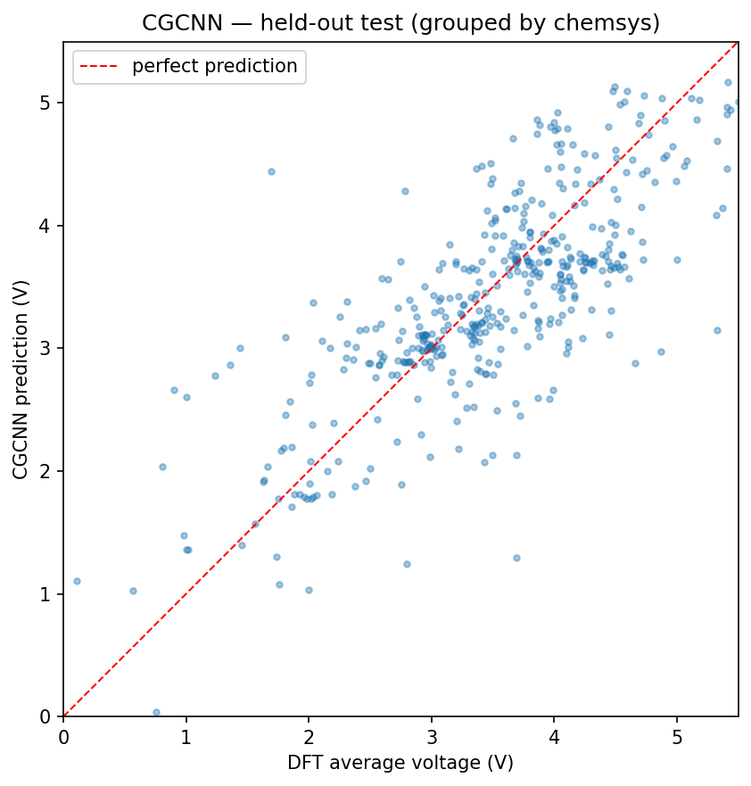
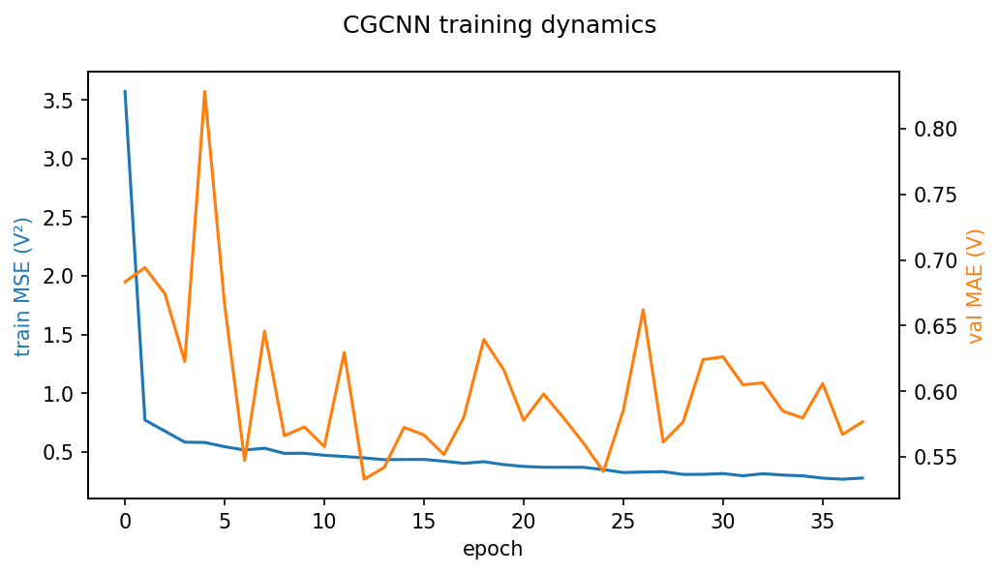

# Does crystal structure actually help predict cathode voltage?
### Three corrections that shrank an apparent 19% improvement to a real 3%

In the previous two posts, I built a physically cleaned battery dataset and established an honest composition-only baseline for predicting Li-cathode voltage. Using grouped evaluation by chemical system, the composition model reached roughly **0.58 V MAE** with **R² ≈ 0.60**.

This post asks the natural next question:

> Does adding full 3D crystal structure materially improve prediction quality?

The short answer is yes — but much less dramatically than I initially thought. More importantly, this post became an exercise in progressively removing optimism from the evaluation until only the real signal remained.

---

## From compositions to crystals

The composition baseline ignored structure entirely.

Two materials with identical formulas but different crystal arrangements would receive identical feature vectors and identical predictions, even though their voltages may differ substantially in reality.

That limitation matters because crystal structure carries information composition alone cannot encode:

- coordination environments
- local bonding geometry
- connectivity
- polymorphism
- orbital overlap pathways

The composition model explained about 60% of the voltage variance. It was plausible that at least part of the remaining variance lived in the 3D arrangement of atoms.

To test that, I built a **CGCNN-style crystal graph neural network**.

### Graph construction

Each crystal structure becomes a graph:

- **Nodes** = atoms
- **Edges** = neighboring atom pairs
- **Node features** = learned embeddings of atomic number
- **Edge features** = Gaussian-expanded interatomic distances

Three message-passing (`CGConv`) layers propagate information through local atomic environments, followed by:

- global mean pooling
- MLP regression head
- predicted average voltage

One design detail mattered significantly: crystals are periodic systems.

Neighbor finding therefore cannot stop at the unit-cell boundary. I used `pymatgen`’s periodic neighbor search (`get_neighbor_list`) so atoms interact correctly across adjacent cells.

A naive 6 Å cutoff initially produced very dense graphs — roughly 77 neighbors per atom on average. Instead, I capped neighbors to the **12 nearest atoms per site**, following the original CGCNN recipe. That adaptive local neighborhood works more robustly across the dataset’s 622 different chemistries.

Final dataset:

- **2,634 crystal graphs**
- grouped split by `chemsys`
- 80/10/10 train/validation/test
- ~80k trainable parameters
- trained on Kaggle’s free T4 GPU

---

## The first result, and why I didn't trust it

The first grouped test run looked excellent.

Single-seed CGCNN:

- **MAE = 0.469 V**

Compared against the earlier grouped composition baseline (~0.58 V), that looked like a dramatic:

- **~19% improvement**

At first glance, it appeared to be a clear:

> “structure wins”

headline.

But two things immediately made me suspicious.

First, the validation MAE curve was noisy and jagged, fluctuating substantially from epoch to epoch. Early stopping was therefore making decisions on a noisy signal, which meant the “best” epoch might simply correspond to a lucky dip in the validation curve.

Second, the entire conclusion rested on:

- one random initialization
- one specific grouped test split

That is not enough evidence for a stable claim.

So I started systematically removing sources of optimism.

That became the real story of the project.

---

## Correction 1 — Single-seed → multi-seed

Deep-learning training is stochastic.

Different random seeds change:

- weight initialization
- minibatch order
- optimization trajectory
- early-stopping behavior

So I retrained the same architecture on **5 different seeds**, keeping the dataset split fixed.

| seed | best val | test MAE | test R² |
|------|----------|----------|---------|
| 0    | 0.545    | 0.499    | 0.527   |
| 1    | 0.573    | 0.507    | 0.495   |
| 2    | 0.601    | 0.519    | 0.481   |
| 42   | 0.575    | 0.483    | 0.494   |
| 7    | 0.583    | 0.505    | 0.508   |

### Final multi-seed result

- **MAE = 0.503 ± 0.012 V**
- **R² = 0.501 ± 0.015**

The spread across seeds was actually fairly small (~2.4%), which suggests the training procedure itself was reasonably stable.

But the original `0.469 V` result was clearly on the optimistic end — about **7% lower** than the true multi-seed mean.

That was the first correction.

**Lesson:** never report a deep-learning result from a single seed.

---

## Correction 2 — Different test splits aren't comparable

Then I realized a second mistake.

The composition baseline (`0.58 V`) came from:

- grouped cross-validation averaged over multiple folds

But the CGCNN result (`0.503 V`) came from:

- one specific grouped split

Different test sets have different difficulty.

So the apparent improvement might partially reflect:

> the GNN receiving an easier test partition

rather than structure genuinely adding predictive power.

To make the comparison fair, I reran the LightGBM composition baseline on the **exact same grouped split** used by the CGCNN.

The result changed the story substantially.

### Apples-to-apples comparison

| model | MAE | R² |
|-------|-----|-----|
| LightGBM (composition) | 0.518 V | 0.477 |
| CGCNN (structure, 5-seed mean ± std) | 0.503 ± 0.012 V | 0.501 ± 0.015 |

The composition model performed significantly better on this particular split than its grouped-CV average (`0.518` vs `0.58`).

This specific test partition happened to favor composition models.

That was the second correction.

---

## Correction 3 — The honest result

After both corrections, the final comparison became:

- Structure improves MAE by **~0.015 V (~3%)**
- Structure improves R² by **~0.024 (~5%)**

Small.

But real.

And importantly:

- reproducible across seeds
- measured on identical splits
- evaluated under chemistry-aware grouping

Not the original 19% headline.

Three layers of optimism had been hiding simultaneously:

1. lucky single seed  
2. comparing against an unlucky baseline average  
3. comparing different test partitions  

Peeling those away was ultimately more valuable than the original flashy result.

---

## What the model actually does (and doesn't) fix

The predicted-vs-actual scatter reveals something important.

The CGCNN predictions hug the diagonal more tightly than the composition baseline, especially in the central voltage regime (~2–4 V). That is the structure model capturing genuinely useful local-environment information.

But the same systematic bias remains:

- high voltages (4.5–5.5 V) are still under-predicted
- low voltages (0–2 V) are still over-predicted

The model continues to regress toward the mean.

That persistence is scientifically informative.

A structure-aware representation did **not** eliminate the bias, suggesting the issue is not only representation quality. It is likely also driven by:

- target-distribution imbalance
- limited data size
- MSE-style regression losses
- scarcity of extreme examples

---

The learning curves explain why the multi-seed correction mattered.

Training loss decreased smoothly, indicating the network was learning meaningful structure-property relationships.

Validation MAE, however, remained noisy.

The validation split contained only:

- 167 graphs
- from 62 chemistries

Small grouped validation sets naturally produce higher variance in per-epoch metrics.

That means early stopping can easily lock onto a lucky minimum.

Multi-seed averaging therefore became necessary for a trustworthy estimate.

---

## What this means scientifically

The final result suggests something important about this particular problem.

Composition already captures the majority of the predictable signal for cathode voltage.

That makes physical sense.

Voltage is strongly governed by:

- which transition metals are present
- valence-electron structure
- electronegativity
- magnetic behavior of partially filled d shells
- broad periodic-table chemistry

Those are exactly the kinds of trends composition-based Magpie descriptors encode well.

Crystal structure still matters.

The CGCNN consistently improved both MAE and R² under honest evaluation, which means local geometry contributes real additional signal.

But on this dataset size and task formulation, structure appears to be a **secondary refinement**, not the dominant factor.

That conclusion is also consistent with much of the materials-informatics literature on moderate-sized battery datasets.

More expressive architectures would likely widen the gap:

- equivariant GNNs (MACE, NequIP)
- MEGNet-style models
- richer edge features
- larger training datasets
- oxidation-state-aware representations

But for this clean apples-to-apples comparison, the conclusion is straightforward:

> Structure helps modestly. Composition carries most of the predictive power.

---

## The honest scorecard

- Dummy baseline: **0.88 V**
- LightGBM composition (grouped CV): **0.58 V**, R² ≈ **0.60**
- LightGBM composition (same grouped split as GNN): **0.518 V**, R² **0.477**
- CGCNN structure (5 seeds, same split): **0.503 ± 0.012 V**, R² **0.501 ± 0.015**

---

## What's next

The natural next step is not:

> “keep tuning the GNN until the improvement gets bigger.”

That would mostly optimize the headline rather than the usefulness.

A more interesting direction is turning the model into a practical screening tool:

- calibrated uncertainty estimates
- confidence-aware ranking
- active learning loops
- DFT budget prioritization
- interactive deployment

The next phase will focus on uncertainty-aware battery screening and a lightweight Streamlit deployment — shifting the project from benchmark reporting toward something genuinely usable.