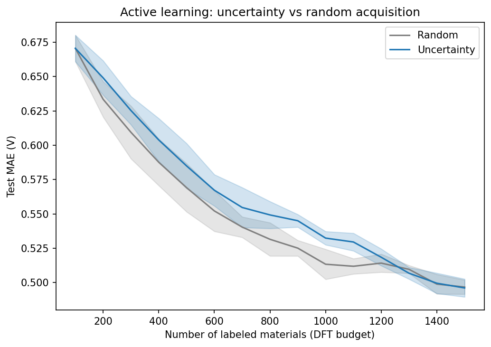

# Honest uncertainty for battery screening — and why active learning backfired
### Calibrated intervals that work, an uncertainty signal that didn't, and a screening tool that says so

In the previous posts, I built a clean Li-cathode voltage dataset, established a composition-only baseline, and tested whether a CGCNN-style crystal graph neural network improved prediction accuracy. The structure model helped, but only modestly after honest evaluation.

This final phase turns the model into something closer to a screening tool by adding uncertainty. The main result is not that uncertainty magically solved the problem — it is that testing the uncertainty honestly revealed exactly what the model could and could not support.

---

## Why a point prediction isn't enough

A screening model that says:

> “This material has a predicted voltage of 4.1 V”

is not enough on its own.

For practical materials screening, the uncertainty matters. A prediction of 4.1 ± 0.1 V is very different from 4.1 ± 0.9 V. The first might support fine ranking between candidates; the second is only useful for coarse triage.

So I added uncertainty estimates on top of the CGCNN model. But I did not want to simply produce error bars and trust them. I wanted to test whether the uncertainty estimates were actually meaningful.

---

## Ensemble uncertainty — and the test it failed

I used a **5-model deep ensemble**, reusing the multi-seed CGCNN models from the previous phase.

For each material:

- each CGCNN produced one voltage prediction
- the ensemble mean became the final point prediction
- the standard deviation across the five predictions became the raw uncertainty estimate

At first, this looked promising.

The per-material ensemble standard deviation ranged from:

- **0.02 V** when the models strongly agreed
- to **0.95 V** when the models disagreed

But raw uncertainty is not useful unless it tracks real error.

So I tested a simple question:

> Do materials with higher predicted uncertainty actually have higher prediction error?

The answer was no.

| check | result |
|-------|--------|
| MAE, low-uncertainty half | 0.467 V |
| MAE, high-uncertainty half | 0.456 V |
| Spearman(std, abs error) | 0.007 (p = 0.88) |

The uncertainty did not track error at all.

The high-uncertainty half was not harder than the low-uncertainty half. The rank correlation between ensemble spread and absolute error was essentially zero.

This means the ensemble disagreement was not identifying genuinely difficult materials. In this setup, it likely reflected optimization-level variation between seeds more than meaningful input-dependent uncertainty.

I also checked one plausible mechanism: whether the models disagreed more on extreme-voltage materials. That also did not give a convincing explanation.

At that point, the right conclusion was not to search for a prettier story on a small test set. The robust finding was simple:

> Ensemble disagreement was an uninformative uncertainty signal here.

---

## Conformal calibration — honest intervals anyway

Even when the per-point uncertainty signal is weak, **conformal prediction** can still produce valid prediction intervals.

The key difference is that conformal prediction does not require the raw uncertainty estimate to be perfectly calibrated. Instead, it uses a held-out calibration set to learn how wide the prediction interval needs to be in order to achieve a target coverage level.

I used split conformal calibration:

- one held-out set to compute calibration residuals
- one disjoint held-out set to verify empirical coverage

The target was 90% coverage.

| | |
|---|---|
| 90% interval half-width | ±0.899 V |
| Empirical coverage on held-out data | 89.1% |

This is the good news:

> The conformal interval worked.

A nominal 90% interval really contained the true voltage about 90% of the time on held-out data.

But there is also a sobering limitation.

Because the ensemble uncertainty was not informative, the calibrated interval became essentially constant width. Every prediction receives the same wide band:

> predicted voltage ± 0.899 V

That is honest, but it is not very sharp.

A ±0.9 V interval is wide relative to the useful voltage range for cathode screening. It can support coarse filtering, such as identifying materials that are probably high-voltage candidates, but it is not good enough for fine ranking among close candidates.

The important point is that the tool now knows its own limitation.

---

## Active learning — where it backfired

The original hope was simple:

> If DFT calculations are expensive, use the model to decide which materials are most worth labeling next.

This is the usual active-learning motivation. Instead of choosing new materials randomly, label the candidates the model is most uncertain about.

I simulated this retrospectively using the LightGBM composition model for speed. The setup was:

- start with 100 labeled materials
- keep the rest as an unlabeled pool
- repeatedly add 100 new labels
- compare two acquisition strategies:
  - random acquisition
  - uncertainty-based acquisition
- retrain after each round
- track test MAE
- repeat over five seeds for error bands

The result was not what I initially hoped.

Random acquisition beat uncertainty acquisition across most of the labeling budget.

Uncertainty sampling did not just fail to improve over random selection. It actively hurt performance.

This connects directly to the previous result.

If the uncertainty estimate does not track real error, then uncertainty-based acquisition is not selecting the most informative materials. Instead, it may preferentially select unusual or outlier-like materials near the edge of feature space.

That creates a distorted training set.

Random sampling, by contrast, keeps the labeled set closer to a representative miniature of the full data distribution. In this experiment, that was more useful than repeatedly adding the model’s most uncertain candidates.

So the finding is coherent:

1. the uncertainty signal did not predict error
2. therefore it was a poor acquisition signal
3. uncertainty-guided active learning underperformed random acquisition

This is not a failure of the project. It is the result the experiment actually gave.

And it is an important one.

---

## The tool: honest by design

The final Streamlit demo is intentionally simple.

It takes a candidate formula or selected material, computes the same composition-based features, and returns:

- predicted average voltage
- calibrated conformal interval
- a clear warning about the model’s limitations

The key design choice is that the app does not hide uncertainty.

Before showing the number, it states the limitations plainly:

- the interval is calibrated but wide
- the model supports coarse screening, not fine ranking
- composition-only predictions cannot fully capture structure, oxidation state, and local coordination effects
- high-confidence-looking point predictions should not be interpreted without the interval

That honesty is part of the tool, not an afterthought.

The goal is not to pretend this is a production-grade battery discovery engine. The goal is to show a complete, scientifically grounded ML workflow that knows where it is reliable and where it is not.

---

## What phase 4 actually showed

Phase 4 produced one coherent uncertainty story.

First, the deep ensemble gave a raw uncertainty estimate, but that uncertainty did not correlate with real prediction error. The model could make different predictions across seeds, but that disagreement was not a reliable signal of which materials were genuinely difficult.

Second, conformal prediction still produced valid coverage. The 90% interval achieved about 89.1% empirical coverage on held-out data. However, because the per-point uncertainty signal was weak, the interval had to be wide and constant: approximately ±0.9 V.

Third, active learning confirmed the limitation. Since the uncertainty signal was uninformative, using it to choose new labels did not improve learning efficiency. In fact, uncertainty-based acquisition underperformed random selection by skewing the labeled set toward less representative candidates.

Together, these results are more useful than a polished but misleading success story.

The honest conclusion is:

> I built an uncertainty-aware screening pipeline, tested whether the uncertainty was meaningful, calibrated the intervals, and showed where uncertainty-guided acquisition failed.

Future improvements would need better uncertainty modeling, not just a prettier interface. Possible directions include:

- heteroscedastic regression
- Bayesian neural networks
- evidential regression
- quantile regression
- diversity-aware acquisition
- hybrid acquisition strategies combining uncertainty and representativeness
- structure-aware uncertainty using larger or equivariant models

---

## The project, end to end

This project now has four connected parts:

1. **Clean data**  
   I built a physically filtered Li-cathode voltage dataset and kept warning metadata instead of blindly deleting it.

2. **Composition baseline**  
   I used Magpie features and LightGBM to establish a strong composition-only baseline under grouped, chemistry-aware evaluation.

3. **Structure model**  
   I trained a CGCNN-style model and showed that structure improves prediction modestly, not dramatically, after correcting for single-seed optimism and split mismatch.

4. **Uncertainty and active learning**  
   I added calibrated prediction intervals, tested whether uncertainty was informative, showed why active learning backfired, and built an honest screening demo.

The through-line is evaluation rigor.

At each stage, the goal was not to get the flashiest number. It was to ask whether the number was trustworthy.

That is the most important lesson of the project:

> A useful scientific ML model is not just one that predicts.  
> It is one that tells you how much you should trust the prediction.